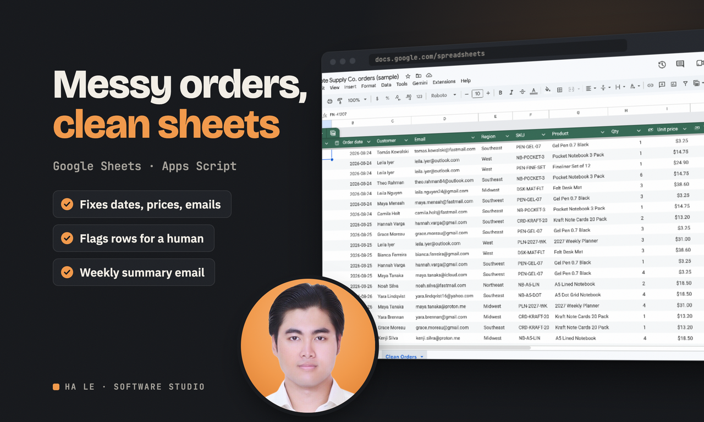

# Order sheet cleanup (sample Google Sheets automation)

This is an Apps Script for Google Sheets that turns a messy order export into a clean table, builds a summary tab with charts, and emails a weekly report every Monday morning. The cleanup handles dates in five formats, prices written as "$1,204.50" or "USD 89", uppercase and misspelled emails, region nicknames, status typos, duplicate orders, blank rows and totals that do not match quantity times price. Rows it cannot fix are kept and highlighted with a note, never dropped.

To use it, open a Google Sheet, go to Extensions, then Apps Script, and paste the four files from `apps-script/` (or push them with clasp). Reload the sheet, then use the new "Order tools" menu: Load sample data, Run everything, or each step on its own, plus "Schedule weekly email" to install the Monday trigger. Put the report recipients in the Settings tab.

The cleaning and summary logic lives in `Clean.gs` with no Google calls, so it also runs in Node. `npm test` runs 8 checks against the full 323 row sample, and `node tools/local-run.js` writes the cleaned rows as tab separated text.

The sample data is synthetic, for a made up shop called Fieldnote Supply Co. In the screenshots, the "Clean Orders" tab was filled by running the same `Clean.gs` logic locally and pasting the values, because the demo Google account blocks unverified scripts.

